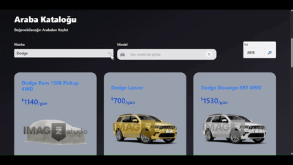

# 🚗 Car Rental Project

## Açıklama

Bu proje, React + TypeScript + React Router + React Paginate kullanılarak oluşturulmuş bir araç listeleme uygulamasıdır.  
Kullanıcılar araçları marka, model ve yıla göre filtreleyebilir, sayfalama ile araçlar arasında geçiş yapabilir.

---

## Özellikler

- Araçları marka, model ve yıla göre filtreleme
- Sayfalı listeleme (pagination) → ReactPaginate
- Araç kartlarıyla görsel listeleme
- Loading ve error handling
- URL query parametreleri ile filtre ve sayfa senkronizasyonu
- Optimize render için `useMemo` kullanımı
- Yeni filtre seçildiğinde `page` ve `year` sıfırlanır

---

## Teknolojiler

- React (v18+)
- TypeScript
- React Router v6
- ReactPaginate
- Tailwind CSS (opsiyonel)
- OpenDataSoft public API (araç verileri)

---

## Kurulum ve Çalıştırma

```bash
# Repo klonla
git clone https://github.com/HasanEROL1/rentCar

# Proje dizinine gir
cd car-rental

# Bağımlılıkları yükle
npm install

# Uygulamayı başlat
npm start


API Kaynakları
Araç Verileri:

Open Data Soft API
Endpoint: https://public.opendatasoft.com/api/explore/v2.1/catalog/datasets/all-vehicles-model/records
Araç Görselleri:

Imagin Studio API
Örnek: https://cdn.imagin.studio/getImage?customer=hrjavascript-mastery&make=BMW&modelFamily=m4
```


# rentCar
